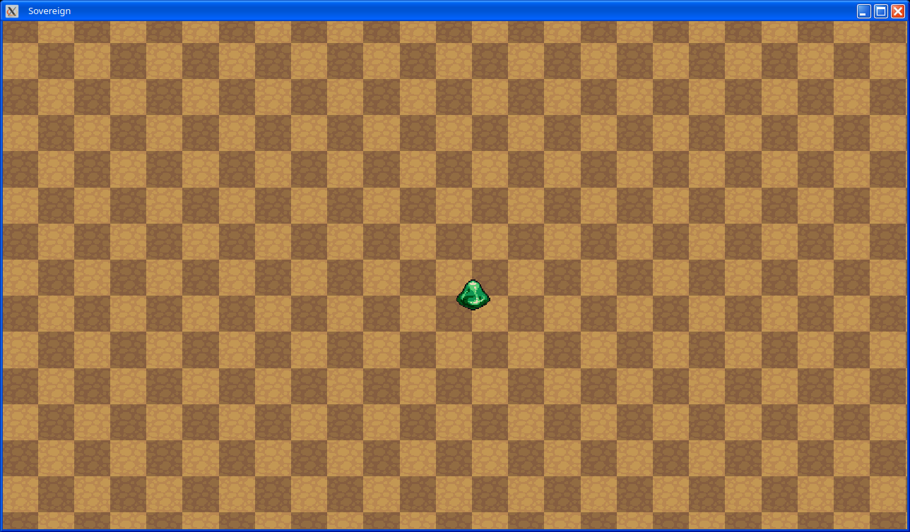

# Sovereign MMORPG Engine - 2D Multiplayer RPG Engine

Sovereign Engine is a 2.5D MMORPG engine with the 2D graphical style of classic RPGs
together with a 3D voxel-based world. The world is highly dynamic and allows
developers and players alike the ability to build homes, mine for resources, farm the
land, and delve into dungeons. Currently in early development, Sovereign will make it easy to
create and share multiplayer RPGs.

Sovereign is developed in C#, runs on Windows and Linux, and is easy to
extend through its distributed Entity-Component-System (ECS) framework.

Sovereign Engine is made available under the GPLv3 license.



## Current Features (v0.1.0)

* Client and server supporting Windows and Linux platforms
* Login and registration (API only, GUI planned for v0.2.0 release)
* Player listing, creation, selection during login (API only, GUI planned for v0.2.0 release)
* Basic rendering of world including automatic borders between neighboring tiles, animated
  sprites, directional sprites
* Sprite metadata including attribution information for easy inclusion of third party
  assets
* Player movement via keyboard
* Distributed entity-component-system (ECS) data model with full client-side synchronization from
  server, full server-side persistence in a relational database (SQLite currently supported,
  Postgres planned)

For full details of the latest changes and features, see the [changelog](CHANGELOG.md).

## Upcoming Features (v0.2.0)

* Client-side GUI support with [Dear ImGui](https://github.com/ocornut/imgui).
* Login GUI.
* Registration GUI.
* Player list GUI.
* Player creation GUI.

## Getting Started

> [!IMPORTANT]
> Sovereign Engine is in a pre-alpha state and is not ready for production use.
> The below instructions are provided for users who are interesting in trying out the
> current features or using the engine as a starting point for their own development.

### Server

1. Download the server binaries for your platform, or compile binaries from source (via
   `dotnet build` and `dotnet publish` from the `src` directory after cloning the Git repository).
2. From the server directory, initialize a new SQLite database:
   ```bash
   $ cd Data
   $ sqlite3 sovereign.db < ../Migrations/Full/Full_sqlite.sql
   ```
3. Enable the debug command interface by editing `Data/Configuration/ServerConfiguration.yaml`
   and changing `EnableDebugMode` to `true`.
   > [!WARNING]
   > Ensure that `EnableDebugMode` is set to `false` before exposing the
   > server's REST API to an external network. The debug API is not authenticated.
4. Run the server:
   ```bash
   $ ./Sovereign.Server
   ```
5. If using a new database, generate a test set of initial world data via the debug interface:
   ```bash
   $ curl -X POST -d'{"Type":"GenerateWorldData"}' http://localhost:8080/debug
   ```

### Client

1. With the server running, simply run the `Sovereign.Client` executable from its directory.
   The client will automatically log in as a default debug account and debug player, registering
   the account and creating the player as necessary.
2. Move the player using the keyboard arrow keys.
3. Close the client application to log out.

## Reporting Issues

Please report any issues to our GitHub [issues tracker](https://github.com/opticfluorine/sovereign/issues).

## Third Party Assets

The Sovereign Engine repository contains a number of third party assets
including spritesets. Attribution information may be found alongside these third party
assets.
