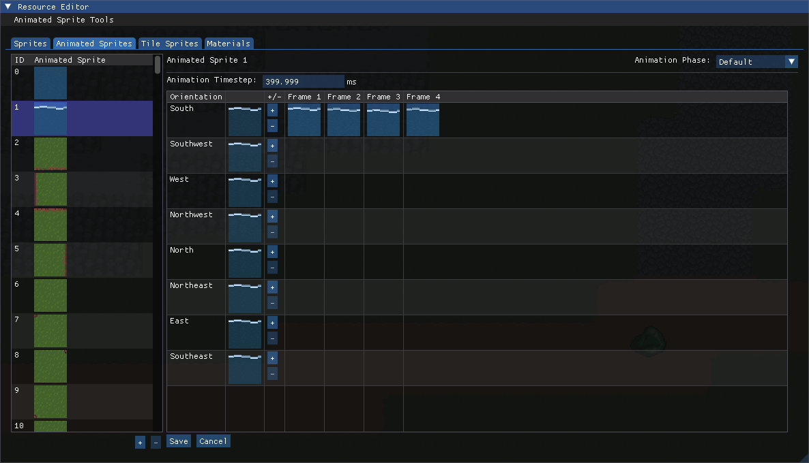
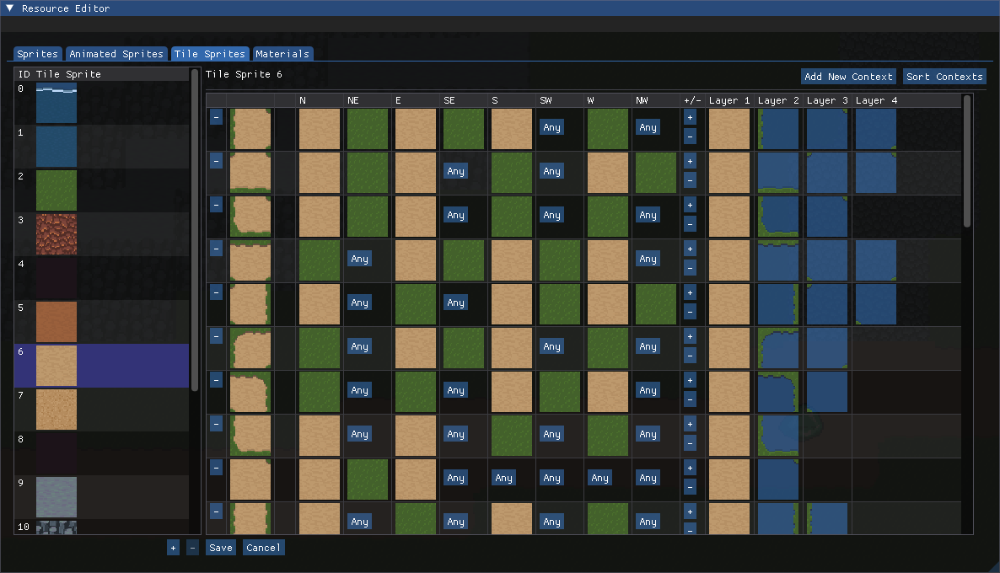

# Resources

Sovereign Engine uses four primary resource types defined in the client: **Sprites**,
**Animated Sprites**, **Tile Sprites**, and **Materials**. These four resource types
determine the appearance of the game world.

## Resource Types

### Sprites

**Sprites** are the simplest graphical resource in Sovereign Engine: a sprite is simply a
static image that can be incorporated into other resources.
Sprites are created from **spritesheets**, image files that contain a grid of same-sized
individual graphics.

When the Sovereign Engine client starts, it loads all of the spritesheets from the
`Data/Spritesheet` directory. Each spritesheet is defined by two files: a PNG file which
contains the graphics, and a YAML file which contains information about the structure
and attribution of the spritesheet. For a single spritesheet, these two files have the
same name but different extension (e.g. `bat.png` and `bat.yaml`). Both files must be
present for the spritesheet to be loaded.

While all of the sprites in a single spritesheet are the same size, not all spritesheets
must have the same size sprites. For example, one spritesheet could contain 32x32 square
tiles, while another spritesheet could contain 32x48 character sprites.

Each sprite is uniquely numbered starting with sprite 0. These ID numbers must be generated
in the [Sprite Editor](#sprite-editor) when the spritesheet is first added. The ID numbers
are tracked in the *sprite definitions* found in the `Data/Sprite/SpriteDefinitions.json` file.

### Animated Sprites

**Animated Sprites** are the basic drawable resource in Sovereign Engine. They can be directly
drawn for an entity by specifying the `AnimatedSprite` component, or they can be further
composited into [Tile Sprites](#tile-sprites).

Animated sprites contain a series of animations which are a list of sprites to be displayed
as the frames of the animation. The animations are distinguished by their *animation phase*
(e.g. standing ("Default"), Moving) and their *orientation* (e.g. north, south, east, west).
Each phase has a list of frames for each orientation, along with a frame interval that specifies
the speed of the animation.

Animations do not need to be defined for every phase and orientation. Missing orientations will
be replaced by a nearby orientation (ultimately the South orientation if no other orientation is
present), and missing phases will be replaced by the Default animation phase.

Each animated sprite is uniquely numbered starting with animated sprite 0. The numbered animated
sprites are tracked in the *animated sprite definitions* found in the
`Data/Sprite/AnimatedSpriteDefinitions.json` file.

### Tile Sprites

**Tile Sprites** are sprites that can be tiled next to each other and change their appearance
based on neighboring tile sprites. For example, a tile sprite for a grass sprite could appear
as all grass when surrounded by other grass tiles, or it could appear as a border between grass
and water if next to a water tile.

Tile sprites contain one or more *tile contexts* which specify a pattern of neighboring tiles
along with a list of animated sprites to draw if the pattern is matched. Every tile sprite must
at a minimum have the *default context* which matches against any combination of neighboring
tile sprites.

When determining which tile context to draw, Sovereign Engine considers the tile contexts in
order from least wildcard neighbors to most wildcards (the default context). The first tile
context matched is used.

Each tile sprite is uniquely numbered starting with tile sprite 0. The numbered tile sprites
are tracked in the *tile sprite definitions* found in the `Data/Sprite/TileSpriteDefinitions.json` 
file.

### Materials

**Materials** are three-dimensional sprites formed by mapping tile sprites onto blocks.
They are used in rendering the many block entities that form the environment.

Each material specifies three tile sprites that comprise its possible faces. The
*front face tile sprite* is vertically oriented and faces outward (e.g. the wall of a cliff).
The *top face tile sprite* is horizontally oriented and faces up (e.g. a walkable grass surface).
Finally, the *obscured top face tile sprite* is the tile sprite rendered in place of the top face
tile sprite when the block is covered by another block (e.g. the top of a cave wall as seen
from the interior of the cave).

The material has one or more *material subtypes* which each have their own set of faces. This allows
for a single material to have multiple appearances to give some variation to the appearance of
the world (e.g. several different grass tiles, some with flowers, some with different placement of
weeds, etc.). These subtypes are uniquely numbered by their *material modifier* starting from 0.

The materials are tracked in the *material definitions* found in the `Data/World/MaterialDefinitions.json`
file.

## Editing Resources

Sovereign Engine includes a built-in resource editor in the client for modifying the
game's graphical resources. To open the resource editor, press the backtick ( ` ) key.

### Adding Tilesheets

Adding a tilesheet must be done outside of the engine. To add a new tilesheet, follow these steps:

1. Copy the spritesheet PNG file to the client's `Data/Spritesheet` directory.
2. Create a YAML file with the same name as the PNG file. For example, if the spritesheet is named
   `bat.png`, name the new YAML file `bat.yaml`.
   :::{tip}
   The easiest way to create the YAML file is to copy an existing YAML file then updating it.
   :::

### Sprite Editor

### Animated Sprite Editor

### Tile Sprite Edtior

### Material Editor

