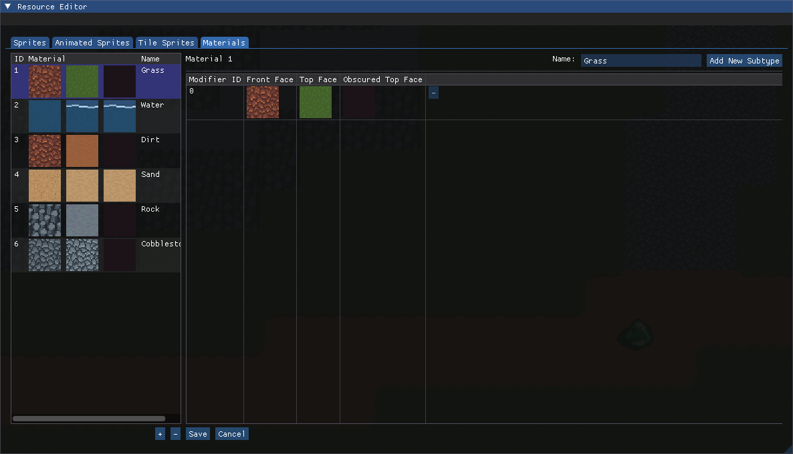

# Client Resources

Sovereign Engine uses four primary resource types defined in the client: **Sprites**,
**Animated Sprites**, **Tile Sprites**, and **Materials**. These four resource types
determine the appearance of the game world.

## Resource Types

### Sprites

**Sprites** are the simplest graphical resource in Sovereign Engine: a sprite is simply a
static image that can be incorporated into other resources. Sprites are created from 
**spritesheets**, image files that contain a grid of same-sized individual graphics.

When the Sovereign Engine client starts, it loads all of the spritesheets from the
`Data/Spritesheet` directory. Each spritesheet is defined by two files: a PNG file which
contains the graphics, and a YAML file which contains information about the structure
and attribution of the spritesheet. For a single spritesheet, these two files have the
same name but different extension (e.g. `bat.png` and `bat.yaml`). Both files must be
present for the spritesheet to be loaded.

While all of the sprites in a single spritesheet are the same size, not all spritesheets
must have the same size sprites. For example, one spritesheet could contain 32x32 square
tiles, while another spritesheet could contain 32x48 character sprites.

Each sprite is uniquely numbered starting with sprite 0. These ID numbers must be generated
in the [Sprite Editor](#sprite-editor) when the spritesheet is first added. The ID numbers
are tracked in the *sprite definitions* found in the `Data/Sprite/SpriteDefinitions.json` file.

### Animated Sprites

**Animated Sprites** are the basic drawable resource in Sovereign Engine. They can be directly
drawn for an entity by specifying the `AnimatedSprite` component, or they can be further
composited into [Tile Sprites](#tile-sprites).

Animated sprites contain a series of animations which are a list of sprites to be displayed
as the frames of the animation. The animations are distinguished by their *animation phase*
(e.g. standing ("Default"), Moving) and their *orientation* (e.g. north, south, east, west).
Each phase has a list of frames for each orientation, along with a frame interval that specifies
the speed of the animation.

Animations do not need to be defined for every phase and orientation. Missing orientations will
be replaced by a nearby orientation (ultimately the South orientation if no other orientation is
present), and missing phases will be replaced by the Default animation phase.

Each animated sprite is uniquely numbered starting with animated sprite 0. The numbered animated
sprites are tracked in the *animated sprite definitions* found in the
`Data/Sprite/AnimatedSpriteDefinitions.json` file.

### Tile Sprites

**Tile Sprites** are sprites that can be tiled next to each other and change their appearance
based on neighboring tile sprites. For example, a tile sprite for a grass sprite could appear
as all grass when surrounded by other grass tiles, or it could appear as a border between grass
and water if next to a water tile.

Tile sprites contain one or more *tile contexts* which specify a pattern of neighboring tiles
along with a list of animated sprites to draw if the pattern is matched. Every tile sprite must
at a minimum have the *default context* which matches against any combination of neighboring
tile sprites.

When determining which tile context to draw, Sovereign Engine considers the tile contexts in
order from least wildcard neighbors to most wildcards (the default context). The first tile
context matched is used.

Each tile sprite is uniquely numbered starting with tile sprite 0. The numbered tile sprites
are tracked in the *tile sprite definitions* found in the `Data/Sprite/TileSpriteDefinitions.json` 
file.

### Materials

**Materials** are three-dimensional sprites formed by mapping tile sprites onto blocks.
They are used in rendering the many block entities that form the environment.

Each material specifies three tile sprites that comprise its possible faces. The
*front face tile sprite* is vertically oriented and faces outward (e.g. the wall of a cliff).
The *top face tile sprite* is horizontally oriented and faces up (e.g. a walkable grass surface).
Finally, the *obscured top face tile sprite* is the tile sprite rendered in place of the top face
tile sprite when the block is covered by another block (e.g. the top of a cave wall as seen
from the interior of the cave).

The material has one or more *material subtypes* which each have their own set of faces. This allows
for a single material to have multiple appearances to give some variation to the appearance of
the world (e.g. several different grass tiles, some with flowers, some with different placement of
weeds, etc.). These subtypes are uniquely numbered by their *material modifier* starting from 0.

The materials are tracked in the *material definitions* found in the `Data/World/MaterialDefinitions.json`
file.

## Resource Editor

Sovereign Engine includes a built-in resource editor in the client for modifying the
game's graphical resources. To open the resource editor, press the backtick ( ` ) key.

### Adding Tilesheets

Adding a tilesheet must be done outside of the engine. To add a new tilesheet, follow these steps:

1. Copy the spritesheet PNG file to the client's `Data/Spritesheet` directory.
2. Create a YAML file with the same name as the PNG file. For example, if the spritesheet is named
   `bat.png`, name the new YAML file `bat.yaml`.
   :::{tip}
   The easiest way to create the YAML file is to copy an existing YAML file then updating it.
   :::
3. Update the information in the YAML file as needed. Make sure that the `Filename` field matches the
   name of the PNG file for the spritesheet, and make sure that the `SpriteWidth` and `SpriteHeight`
   fields are set correctly. Finally, make sure that the attribution fields `Author` and `License`
   are set correctly, especially if you are using third party assets.
4. Once a tilesheet is added, start the client and generate its sprite definitions using the
   [Sprite Editor](#sprite-editor).

### Sprites Tab

The **Sprites** tab in the Resource Editor allows you to browse the current spritesheets 
and generate sprite definitions from them. The *Spritesheet* combo selector at the top-left 
allows you to select which spritesheet to work with.

:::{tip}
If you do not see your spritesheet in the drop-down list, this means it probably has not
been correctly added. Ensure that you have followed all of the steps in
[Adding Tilesheets](#adding-tilesheets), then restart the engine. If the spritesheet
still isn't listed, check the client log for any error messages related to the
spritesheet.
:::

If sprites have already been generated for a spritesheet, you will see grey boxes around
each sprite. Hovering over a sprite will display its sprite ID. If any sprites are
missing (no grey box, no ID when hovering), click the *Generate Missing Sprites* button
at top-right to automatically generate them.

### Animated Sprite Tab

The **Animated Sprites** tab in the Resource Editor allows you to create, edit, and delete 
animated sprites.

#### Animated Sprite Browser

The *animated sprite browser* at the left allows you to browse and select animated
sprites. The currently selected animated sprite is highlighted. To select an animated
sprite, click on the image of the sprite (clicking on the space around it or on the
ID number will not select the animated sprite).
:::{warning}
Selecting an animated sprite in the browser, changing to a different tab in the
resource editor, or closing the resource editor will cause any unsaved changes to be
lost.
:::
The *+* and *-* buttons below the browser allow you to create or delete animated sprites.
Clicking the *+* button will add a new animated sprite after the currently selected
animated sprite. Clicking the *-* button will remvoe the currently selected animated
sprite. If for any reason the animated sprite cannot be deleted (e.g. it is the only
animated sprite, it is used in a tile sprite, etc.) the *-* button will be disabled and
the reason will be displayed when the mouse is hovered over the button.)
:::{warning}
Deleting animated sprites is only recommended early in development while resources are
first being loaded. Deleting an animated sprite will change the ID numbers of all later
animated sprites; however, any `AnimatedSprite` components on entities stored in the
server will *not* be updated. For this reason it is best to avoid deleting animated
sprites once you have started developing server-side content.
:::

#### Animated Sprite Editor

The *animated sprite editor* is displayed to the right of the browser. Changes made
in the editor are not saved until the *Save* button at the bottom is clicked. To undo
any changes that have not yet been saved, click the *Cancel* button at the bottom.

At the top-right of the editor is the *Animation Phase* selector. This allows for
animations to be defined for different animation phases (default, moving, etc.).
When a new animated sprite is created, the *Default* animation phase is automatically
created. Other phases are created when they are selected and populated. To remove an
animation phase, delete all of the animation frames for that phase. Note that the
Default animation phase may not be deleted, as the renderer will fall back to the
default phase if the current animation phase is not defined fro an animated sprite.

Each animation phase may have a different timestep between its frames. This value is
set using the *Animation Timestep* input box at top left.

Each animation phase is built from one or more *orientations* and associated animations.
The orientation corresponds to the direction an entity is facing when it is rendered.
Next to each orientation is a live preview of the animation for that orientation. Note
that live previews are shown even for orientations which have no frames; these
orientations will fall back to another orientation if they are not defined.

The *+* and *-* buttons to the right of the live preview are used to add a new frame
to the end of the list or to remove the last frame in the list respectively. Similarly
to the browser, the *-* button will be disabled if the frame cannot be removed, and the
reason will be displayed if the mouse is hovered over a tooltip.

The individual frames may be edited by clicking on them. This opens the sprite selector
popup. To select a sprite, first use the top dropdown to select the spritesheet, then
click on the corresponding sprite.

:::{tip}
If nothing happens when you click on a sprite, switch to the Sprite Editor and 
ensure that the sprite definitions have been generated for that spritesheet.
See [Generating Sprites from Spritesheets](#generating-sprites-from-spritesheets) for
more information.
:::

### Tile Sprites Tab

The **Tile Sprites** tab allows you to create, edit, and delete tile sprites.

#### Tile Sprite Browser

The *tile sprite browser* at the left allows you to browse and select tile
sprites. The currently selected tile sprite is highlighted. To select a tile
sprite, click on the image of the sprite (clicking on the space around it or on the
ID number will not select the tile sprite).
:::{warning}
Selecting a tile sprite in the browser, changing to a different tab in the
resource editor, or closing the resource editor will cause any unsaved changes to be
lost.
:::
The *+* and *-* buttons below the browser allow you to create or delete tile sprites.
Clicking the *+* button will add a new tile sprite after the currently selected
tile sprite. Clicking the *-* button will remvoe the currently selected tile
sprite. If for any reason the tile sprite cannot be deleted (e.g. it is the only
tile sprite, it is used in a tile sprite, etc.) the *-* button will be disabled and
the reason will be displayed when the mouse is hovered over the button.

#### Tile Sprite Editor

The *tile sprite editor* is displayed to the right of the browser. Changes made
in the editor are not saved until the *Save* button at the bottom is clicked. To undo
any changes that have not yet been saved, click the *Cancel* button at the bottom.

As described in [Tile Sprites](#tile-sprites), tile sprites consist of a list of
*tile contexts* which specify a list of animated sprites to draw when a specific pattern
of neighboring tiles (which may include any number of wildcards) is matched. The tile
sprite editor displays these contexts in rows. New rows may be added by clicking the
*Add New Context* button at top right. The columns of each row are, in order:

* A *-* button that removes the tile context. Note that the default context
  (all wildcards) may not be removed.
* A preview of the tile sprite when its pattern is matched. When the preview is hovered,
  a popup appears showing a larger preview of the tile surrounded by its neighbors.
  :::{tip}
  If the preview does not look correct, try clicking the *Sort Contexts* button at
  top right. Sometimes when the pattern of a tile context is modified, it is in the
  wrong spot in the list and is incorrectly matched to an earlier entry. Sorting the
  list resolves this issue. The list is also automatically sorted when the tile sprite
  is saved.
  :::
* Neighboring tiles for the north, east, south, and west directions in order. Clicking
  on the neighboring tile will open the tile sprite selector allowing for another tile
  sprite or wildcard to be selected.
* Controls for adding or removing animated sprite layers to the tile context. Similar
  to the [Animated Sprite Editor](#animated-sprite-editor), the *+* button adds a new
  layer to the end while the *-* button removes the last layer. There must always be
  at least one layer for each tile context.
* The layers of the tile context in the order in which they will be drawn. Clicking on
  a layer opens the animated sprite selector allowing for another animated sprite to be
  selected.

### Materials Tab

The **Materials** tab allows you to create, edit, and delete materials.

#### Materials Browser

The *material browser* at the left allows you to browse and select tile
sprites. The currently selected material is highlighted. 
The three tile sprites shown are the three faces of the sprite: the front face,
the top face, and the obscured top face. To select a material,
click on any of the iamges (clicking on the space around it, on the
ID number, or on the name will not select the material).
:::{warning}
Selecting a material in the browser, changing to a different tab in the
resource editor, or closing the resource editor will cause any unsaved changes to be
lost.
:::
The *+* and *-* buttons below the browser allow you to create or delete materials.
Clicking the *+* button will add a new material after the currently selected
material. Clicking the *-* button will remvoe the currently selected tile
sprite. If for any reason the material cannot be deleted (e.g. it is the only
material, it is used in a material, etc.) the *-* button will be disabled and
the reason will be displayed when the mouse is hovered over the button.
:::{warning}
Deleting materials is only recommended early in development while resources are
first being loaded. Deleting a material will change the ID numbers of all later
materials; however, any `Material` components on entities stored in the
server will *not* be updated. For this reason it is best to avoid deleting materials
once you have started developing server-side content.
:::

#### Materials Editor

The *materials editor* shows the table of material subtypes for the selected material.
Changes made in the editor are not saved until the *Save* button at the bottom is 
clicked. To undo any changes that have not yet been saved, click the *Cancel* button at 
the bottom.

Along the top is the input field for the material name along wih the
*Add New Subtype* button which adds a new row to the table. Each row of the table shows
the material modifier ID, the three faces of the material, and a *-* button for
removing a material subtype. Clicking on any face of the material opens the tile
sprite selector allowing for another tile sprite to be selected.
