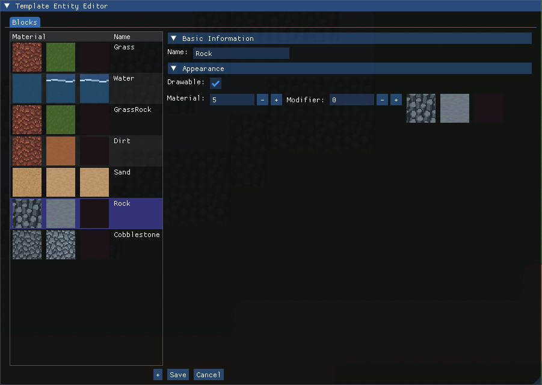

# Template Entities

Most entities are not unique - every block of grass shares most of the same components, every
NPC of a given type, every item of a given type, etc. **Template Entities** allow you to create
a *template* for a given type of entity.

## Creating Reusable Entities Using Templates

A template entity is an entity which specifies a set of component values to *inherit* as default
values by any entity which inherits the template. For example, a grass block template entity would
specify the `Material` and `MaterialModifier` components corresponding to a grass material; every
block of grass would then inherit this template and have the grass material by default.

When an entity inherits a template entity, it takes on the same component values as the template
by default. If a component is specified for both the entity and its inherited template, the
value assigned to the entity takes effect over the template value.

## Defining Template Entities

Template entities can be defined using the integrated **Template Entity Editor** that is built
into the Sovereign Engine client. To open the editor, first log into the server as a player with
the Admin role, then press the `Ins` key. The Template Entity Editor should be displayed.

### Creating and Modifying Block Template Entities

**Block Template Entities** are template entities which specify the properties of a block entity.
They can be created and modified through the Template Entity Editor using the *Blocks* tab.

The left-hand side of the editor displays a list of all Block Template Entities known to the server.
New Block Template Entities may be created by clicking the *+* button below the list; this will
create a new Block Template Entity on the server with default values.

Block Template Entities may be opened for editing by clicking them in the left-hand list. The actively
selected Block Template Entity is highlighted in the list, and its editable properties are displayed
in drop-down categories to the right. The following components may be modified for a Block Template
Entity:

| Component         | Purpose                                               | Default Value         |
| ----------------- | ----------------------------------------------------- | --------------------- |
| Name              | Name for the Block Template Entity. Should be unique. | *(blank)*             |
| Drawable          | Whether the block can be drawn. Usually true.         | Checked               |
| Material/Modifier | Material and modifier for the block.                  | Material 1/Modifier 0 |

Clicking the *Save* button at the bottom of the editor will send the updated values to the server, and
the updated Block Template Entity will be sent to all connected clients. Clicking the *Cancel* button
will revert any local changes; the selected Block Template Entity will then match the definition from
the server.

Block Template Entities may not be deleted. This is by design to prevent blocks from referencing a
template that no longer exists. If a template is no longer needed, the recommended best practice is
to deprecate the template by changing its Name component to an appropriate value (e.g. *Deprecated*).

### Creating and Modifying NPC Template Entities

**NPC Template Entities** are template entities which specify the properties of an NPC entity. They can be created and modified through the Template Entity Editor using the *NPCs* tab.

The left-hand side of the editor displays a list of all NPC Template Entities on the server. New NPC templates can be created by clicking the *+* button below the list, which will create a new NPC template with default values on the server. As with other types of template entities, they may not be deleted once created.

An NPC template can be opened for editing by clicking it in the left-hand list. The actively selected NPC Template Entity is highlighted in the list, and its editable properties are displayed in drop-down categories to the right. The entity's components are listed first followed by scripting options and entity key-value data.

The following components may be modified for an NPC Template Entity:

| Component             | Purpose                                                                                                                                              | Default Value     |
| --------------------- | ---------------------------------------------------------------------------------------------------------------------------------------------------- | ----------------- |
| Name                  | Name of the NPC. Ideally should be unique.                                                                                                           | *(blank)*         |
| Animated Sprite       | Animated Sprite to render for the entity.                                                                                                            | Animated Sprite 0 |
| Drawable              | Whether to render the NPC, and if so, the offset from the entity's position at which to draw the sprite.                                             | Not Selected      |
| Cast Shadows          | Whether the entity should cast shadows. If true, the Shadow Radius specifies the size of the shadow.                                                 | False             |
| Point Light Source    | If selected, specifies a point light source effect attached to the entity.                                                                           | Not Selected      |
| Server Only           | Whether the NPC is hidden from clients.                                                                                                              | False             |
| Physics               | Whether the NPC is affected by physics. If selected, the bounding box parameters specify its behavior.                                               | Not Selected      |
| Bounding Box Position | Relative position of the bottom-left-front corner of the physics bounding box. 0.0 specifies no shift, 0.5 is centered, 1.0 is at the opposite edge. | (0, 0, 0)         |
| Bounding Box Size     | Size of the physics bounding box in world units.                                                                                                     | (1, 1, 1)         |

Clicking the *Save* button at the bottom of the editor will save any changes. Clicking the *Cancel* button will revert any local changes.

### Attaching Scripts to Template Entities

Custom behaviors can be attached to NPC template entities through a number of hooks available at the bottom of the Template Entity Editor.

Each supported hook allows for the selection of a *Script* and a *Function*. Upon selecting a script, the *Function* drop-down is enabled and automatically populated with a default function for the file. The supported hooks are summarized in the table below. For more information regarding the four entity lifecycle hooks, see [Entity Lifecycle](#entity-lifecycle).

| Hook            | Purpose                                                                              |
| --------------- | ------------------------------------------------------------------------------------ |
| Entity Added    | Called when an entity is newly added.                                                |
| Entity Loaded   | Called when an entity is added and/or loaded.                                        |
| Entity Removed  | Called when an entity is removed/deleted.                                            |
| Entity Unloaded | Called when an entity is unloaded and/or removed.                                    |
| Interact        | Called when a player interacts with the entity (e.g. by pressing E or using a tool). |

The *Script Parameters* section shows parameters to the selected scripts and functions. Hovering the mouse over the name of a parameter will display a tooltip explaining the parameter.

:::{tip}
Script parameters are stored as entity key-value data. If you switch scripts and/or functions after entering parameters, the data will not be lost; it will instead move to the *Entity Data* section if the parameter is no longer needed by the choice of scripts and functions.
:::

The *Entity Data* section shows any other entity key-value pairs for the template that are not shown under *Script Parameters*. To add a new key-value pair, enter the key in the text box at the end and click the *Add* button, then enter the value next to the newly added key.
