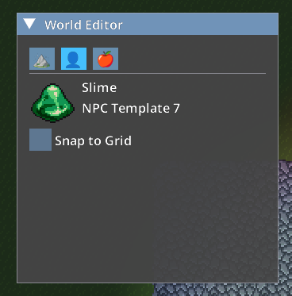

# Editing the World

The Sovereign Engine client includes an integrated **World Editor** for easy modification
of the game world. To open the World Editor and begin editing the world, press the **Del**
key while in the game.

:::{note}
The World Editor can only be used by players with the Admin role.
:::

## Using the Block Editor

The World Editor is controlled through a window that appears whenever the editor is active. Selecting the mountain icon button at the top of the editor activates the block editor. Several pieces of information are displayed in this window:

| Property       | Meaning                                                               |
| -------------- | --------------------------------------------------------------------- |
| Block Template | The block template that will be placed by the editor.                 |
| Z Offset       | The z coordinate (relative to player) at which blocks will be placed. |
| Pen Width      | The width in blocks of the pen used to place or remove blocks.        |

Instructions for adjusting these properties are displayed at the bottom of the World Editor window. Scrolling with the mouse wheel adjusts the currently selected Block Template entity. Holding **Ctrl** while scrolling adjusts the Z Offset. Holding **Shift** while scrolling adjusts the Pen Width.

:::{tip}
If the World Block Editor window is not responding to mouse scrolls, make sure that the mouse is not hovering over any GUI windows. When the mouse hovers over a GUI window, the GUI captures all mouse events before they reach the editor.
:::

While the World Block Editor is displayed, left clicking on the world will place a block with the selected Block Template at the selected mouse position and Z Offset relative to the player's current z coordinate. Right clicking will remove the block at that position. Holding down the mouse button and dragging will make the corresponding change to all positions over which the mouse is dragged. Blocks are placed or removed in a square centered on the cursor with width equal to the current Pen Width. Note that you can still move the player using the **WASD** or **arrow** keys while the World Editor is open.

:::{tip}
If the World Editor window is obstructing the view of what you are editing, you can click the triangle at top-left to collapse the window.
:::

To finish editing and close the World Editor window, press the **Del** key again.

## Using the NPC Editor

Selecting the profile icon button at the top of the World Editor activates the NPC editor. Scrolling with the mouse changes the selected NPC template.

While the World NPC Editor is displayed, left clicking on the world will add a new NPC entity with the selected template at the mouse position. If the *Snap to Grid* box is checked, the new NPC's position will be clamped to a block position. Right clicking on an NPC will remove that NPC.
