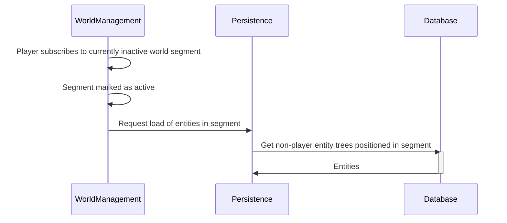
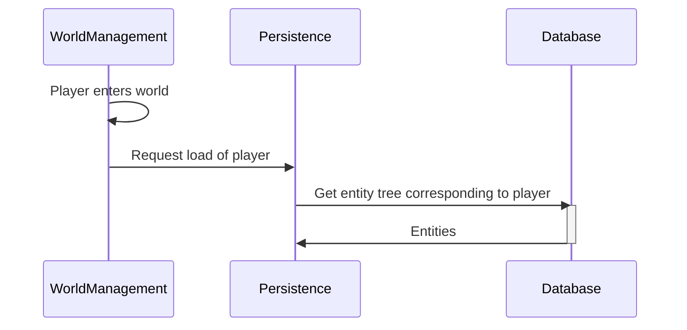
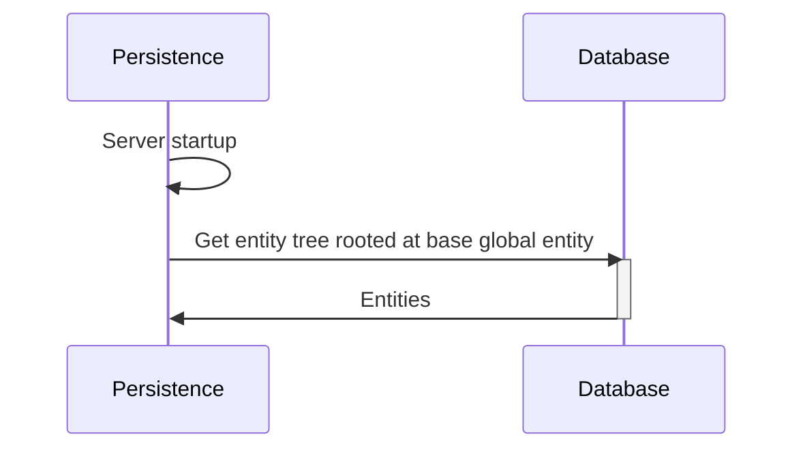

# Persistence

The Persistence system and supporting code is responsible for persisting entities to a relational
database on the server side. Sovereign Engine supports storing and retrieving entities and a subset
of their components and tags. This document describes how Sovereign Engine approaches the storage
and retrieval of entities.

## Database Structure

The database is structured as a set of highly normalized component tables related by the entity ID.
Joining these tables on the entity ID provides a consolidated view of every entity and its components.
Increasing normalization carries a performance penalty due to the increased number of random access
reads and writes incurred; decreasing normalization carries a space penalty due to the increased number of
null-valued fields that must be explicitly stored on disk.

Normalization is preferred by default due to
the high storage requirements imposed by the very large number of entities which compose a world. For example,
every block is an entity with associated position and material information, but little other information. Reducing
entity normalization (i.e. moving a field from a separate table into the parent entity table) would drastically
increase the world storage size as each block acquires an extra null-valued field that must be persisted to disk.
Therefore new components are added in a denormalized way first, then only normalized if the performance benefits
outweigh the increased storage cost.

## Storage

To be written.

## Retrieval

Entity retrieval is done by the server in a just-in-time manner to ensure the correct entities are present in
memory for game processing to proceed. In order to scale to large worlds, Sovereign Engine must only process the
portion of the game world that is local to each logged in player character; all other processing must be done in
a just-in-time ("fast forward") manner when entities are loaded out of necessity.

For example, consider the case where a player plants a number of seeds that will grow into plants over a fixed
duration of game time. The player then logs out, and no other players are active in that region of the world. The
entities corresponding to the growing plants would then be unloaded in order to conserve memory. Some time later,
after the time at which the plants are expected to have grown, the player logs back in and revisits the area. The
entities would be loaded from the database in the "seed" state in which they were persisted, then "fast-forwarded"
to the current game time in a just-in-time manner so that, to the player, it appears as if the state of the game
world has continued to evolve while they were disconnected.

The persistence layer and its retrieval function are responsible only for the act of retrieving the persisted entity
in its persisted state from the database. It is the job of the other relevant systems (e.g. a time growth system
for the case described above) to apply the fast-forward logic once the entity has been loaded into memory.
As such, this document will only focus on the process of loading the entity from the database.

### Entity Activation and Retrieval

The persistence system must only load entities from the database when they become relevant to a region of the world
local to a logged in player character. This requirement drives a number of cases which trigger the persistence system
to retrieve entities in certain ways as described below. Entities are referred to as "active" or "inactive" based on
whether they are required to be retrieved based on the rules described below. The persistence system is responsible
for identifying and loading the active entities; inactivation is handled separately (though the persistence system
must still ensure that every inactivated entity is persisted to the database before it is removed from memory, as
described separately).

#### Global Entities

Global entities are those which are, by definition, always relevant to the active subset of the world. These are
typically entities which do not have any defined position, but instead serve to encode configuration information or
other metadata within the world structure. They are automatically retrieved at server startup.

#### Child Entities

Entities form a tree structure where every entity is associated with a parent. This can be either an explicit
parent-child relationship with another entity (e.g. an inventory container associated to its owner), or an implicit
relationship to the (also implicit) "root" entity. Therefore the entire game world is represented as a single tree
of entities. With one very important exception, all of the children of an entity become active when the parent entity
becomes active. The exception is for entities corresponding to player characters - these entities only become
active under the specific conditions described in their section below.

Note that the implicit root entity *never* becomes active, and so the parent-child activation rules only apply to
at most a portion of the game world.

#### Player Character Entities

Player character entities are activated and retrieved one-by-one as they log in. They are never activated as a result
of the parent-child activation rules described above, or as a result of the position activation rules described below.
They are inactivated immediately when the player logs out.

#### Positioned Entities

The last category of entities to be considered are the entities which have a defined position component. These
entities are activated when they are located within a world segment that is within a certain distance of a
currently active player character entity. They are eligible for inactivation whenever their corresponding world
segment is out of range of all active player character entities (though they may be retained in memory longer
if resources permit). As usual, the exception is for other player character entities - as described above, player
character entities are only loaded as a result of that player logging in.

Note that positioned entities must not have a parent entity; they must be at the root level in
order for range-based entity activation to work correctly.

#### Activation Rules Example

To understand how the activation rules work together to ensure the correct entities are loaded for processing,
consider the following example that occurs when a player logs into an otherwise empty server.

1. At server startup (prior to the player logging in), the global entities are automatically loaded. They are
   considered active for the lifetime of the server process.
2. When the player logs in, the player character entity is loaded (see "Player Character Entities" above). All
   child entities of the player character (e.g. inventory, equipment, etc.) are also activated (see "Child
   Entities" above), as are any child entities of these entities and so on.
3. The player character entity is now loaded and located at a specific position in the game world. As a result,
   all of the positioned entities (excluding other player characters) in each world segment within a certain
   radius of the player are also activated (see "Positioned Entities" above). These entities may also have
   child entities of their own which are then activated (see "Child Entities" above). As before, these child
   entities may have child entities of their own, and so on recursively to an arbitrary depth; all of these
   entities are then loaded by the same rules.

#### System-Level Activation Sequences

##### General loading case, server-side

##### Player enters world (except for new player creation which bypasses persistence), server-side

##### Server startup

