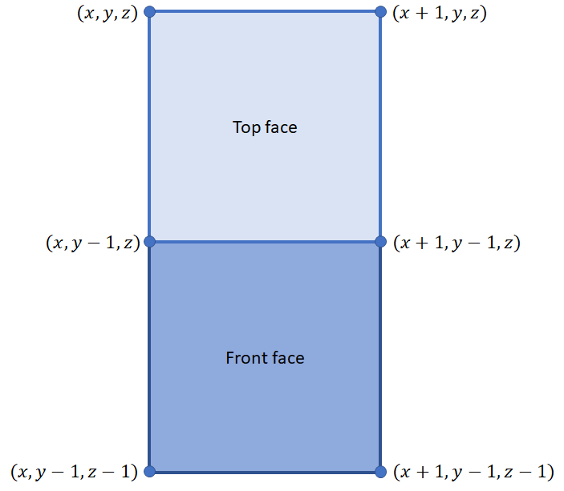

# World Structure

## Game World

The game world is a collection of one or more "domains", where a domain is a
disconnected three-dimensional segment of the world. By "disconnected", we
mean that there is no trajectory in three-dimensional space by which an
object may transition from one domain to another. Note that this does not
preclude the existence of "portals" or other scripted gateways which move
objects from one domain to another.

The world exists in a three-dimensional coordinate system where the
x coordinate runs west to east, the y coordinate runs south to north, and
the z coordinate runs bottom to top (in depth). The domain is comprised of
a three-dimensional grid of blocks - cubes of unit length - each of which
is assigned (at a minimum) a material identifier and a material modifier.
As each block is tracked within the engine as an independent entity,
additional information can be associated with a block by linking the
corresponding component.

## Materials

A material defines the base type of a block. The material of a block
is specified by a pair of unsigned 32-bit integers, the material ID and the 
material modifier. The material ID defines the specific type of material
(e.g. grass, sand, water). The material modifier indicates which particular
appearance of the material the block will take.

Each material specifies three tile sprites: the top face, the side face,
and an alternate top face to be shown if a face is obscured. The top face
is the horizontal surface in the xy plane, and the side face is the vertical
surface in the xz plane.

## Blocks

Each domain is constructed of a collection of blocks as described above.
A block is a unit cube (in position units) with side lengths equal to the
tile dimension (in pixels) when rendered. Material blocks must be of unit
length, but other entities may have arbitrary dimensions. All entities
(material blocks and otherwise) are positioned by the upper-top-left corner
of the unit length block whose base is centered on the bottom plane of
the entity.

